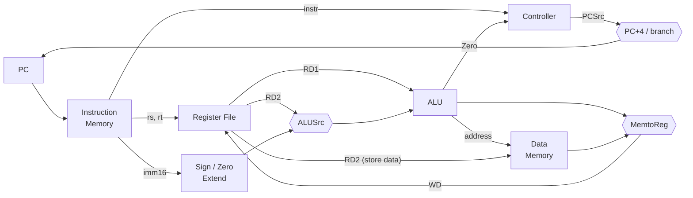

# Single-Cycle MIPS Processor (Verilog)

A 32-bit single-cycle processor implementing a subset of the MIPS ISA, written in Verilog at the RTL level. Every instruction completes in one clock cycle. The design includes a combinational controller, a datapath with a register file and ALU, and separate instruction and data memories.

The processor passes the instructor-provided functional tests, including an **insertion-sort program** that generates and sorts 96 32-bit numbers in memory.

This was a project for the **Computer Architecture & Microprocessors** course at Sharif University of Technology. A follow-up multi-cycle design is at [multi-cycle-mips](https://github.com/Sharifi-Reza/multi-cycle-mips).

---

## Supported Instructions

| Format | Instructions |
|---|---|
| R-type | `add`, `addu`, `sub`, `subu`, `and`, `or`, `xor`, `nor`, `slt`, `sltu` |
| I-type, arithmetic/logic | `addi`, `addiu`, `slti`, `sltiu`, `andi`, `ori`, `xori`, `lui` |
| I-type, memory | `lw`, `sw` |
| I-type, branch | `beq`, `bne` |

---

## Architecture



### Datapath

- **Instruction and data memory:** two separate `async_mem` instances, each holding 1024 words (4 KB) and addressed by word (`address[11:2]`). Reads are asynchronous and writes happen on the clock edge.
- **Register file:** 32 × 32-bit registers with two read ports and one write port. `$0` is forced to zero. Defining `DEBUG` prints every register write during simulation.
- **Immediate extension:** sign or zero extension, selected by the controller signal `SZEn`. Logical immediates (`andi`, `ori`, `xori`) are zero-extended.
- **Next PC:** `PC + 4`, or the branch target `PC + 4 + (imm << 2)` when `PCSrc` is set.

### ALU

The ALU uses a **single 33-bit adder** for both addition and subtraction. To subtract, it inverts B and sets the carry-in. Every comparison is derived from that same adder:

- `sltu` comes from the carry out (`!sum[32]`).
- `slt` uses the overflow flag: `slt = V ⊕ sum[31]`. This gives the correct signed comparison even when the subtraction overflows.
- `lui` places the immediate in the upper half: `{B[15:0], 16'h0}`.
- The `Zero` flag drives `beq` and `bne`.

### Controller

The controller is a combinational `always @(*)` block. It decodes the opcode, plus the funct field for R-type instructions, and produces `RegDst`, `ALUSrc`, `MemtoReg`, `RegWrite`, `MemWrite`, `SZEn`, `PCSrc`, and a 4-bit `AluOP`. For branches, `PCSrc` is computed from the ALU's `Zero` flag: taken when Zero is set for `beq`, and when it is clear for `bne`.

---

## Repository Structure

```
.
├── single_cycle_mips.v   # Top-level CPU: controller, datapath, ALU (my_alu)
├── building_blocks.v     # async_mem (instruction/data memory) and reg_file
├── tb__basic/            # Basic instruction test (basic.hex)
└── tb__isort/            # Insertion-sort workload (isort32.hex, exp_sorted_numbers.hex)
```

---

## Verification

| Testbench | Program | Checks | Result |
|---|---|---|---|
| `tb__basic` | `basic.hex` | Runs until PC = `0x9C`, then dumps data memory words 50–70 for comparison with the expected values | ✅ Pass |
| `tb__isort` | `isort32.hex` | Generates 96 pseudo-random 32-bit words in memory, sorts them in descending unsigned order (using `sltu`), checks that the result is sorted **and** matches the expected output word for word, and confirms it finishes within the cycle budget | ✅ Pass |

The isort testbench reports two independent checks: `PASS1, All Sorted!` and `Pass2, Output Matches the expected Numbers!`.

---

## Running the Simulation

Each testbench loads its program with `$readmemh`, so run the simulator from inside the testbench folder, where the `.hex` files are. For example, with Icarus Verilog:

```bash
cd tb__isort
iverilog -o sim ../single_cycle_mips.v ../building_blocks.v *.v
vvp sim
```

ModelSim or Questa work the same way: compile the two design files plus the testbench, then run until `$stop`. If your simulator has trouble reading files, comment out `` `define READ_FROM_FILE `` in the isort testbench. It then uses an inline copy of the program instead.


## Author

**Mohammadreza Sharifi**
B.Sc. Electrical Engineering (Electronics), Sharif University of Technology
